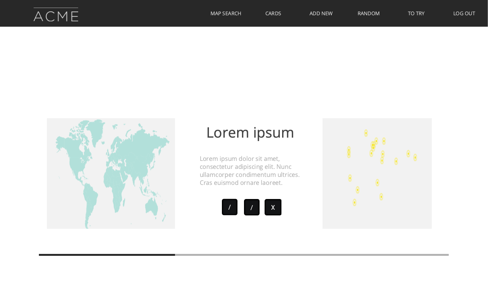
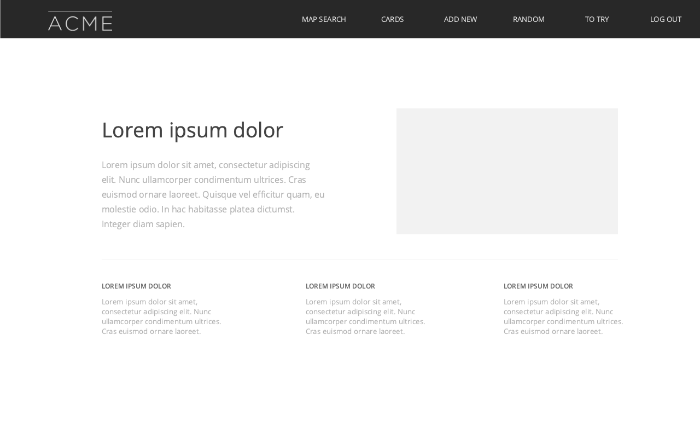

# Eatwat - A restaurant tracking app

## User Story
“As a foodie frequenting a multitude of restaurants, I desire an effortless way of recording my ventures, to curate a list of delectable food that I personally savor.”

## HEROKU APP LINK
[link to App!](https://eatwat-app.herokuapp.com/)
----------------------------------

## Technologies
- **Mapbox** Client side rendering of map, geocoding search and tileset rendering used
- **dotenv** To protect tokens used in mongoDB and Mapbox
- **methodOverride** To allow for patch and delete 
- **partials** Used to make ejs files neater
- **multer** handles multi-part form processing and image processing
- **streamifier** opens up streams to upload image directly
- **cloudinary** Cloud Storage for storage of image files and generate image URL
- **bcrypt** Used to hash passwords
- **express-session** For creating session-cookies and storing user information
- **mailjet** API used for sending emails with customised templates

## Experimented 
- **cloudinary with express-file-upload**
- wireframing using **justinmind**
- multiple models

-----------------------------

## Approach
* read up on documentation for mapbox and geocoding search and testing of mapbox functions
* wireframing
* setting up database structure
* set up mvc structure with crud routes
* add form information into database
* testing of upload function with multer and cloudinary
* build mapsearch pages
* build routes to edit database form information
* create login/logout/authentication/authorisation
* add services layer
* test out validations
* final check
* deploy on Heroku

## Initial Wireframes
* Index page with all eats

* Show single eat

* Form for adding new eats

* Form for map search

* Show restaurants after mapsearch

* Show random recommendations

* Add restaurants to try 

------------------------------------------
## Database structure
* **FormData** Model Tree Structures with Child References
* **MRT** Model Tree Structures with Parent References
* **Eats** Model Tree Structures with Parent References
* **Users** Model Tree Structures with Parent References

## Role-based authentication
* admin can see all user eats, and use dashboard to edit form data
* user can only access own eats

## RESTful Routes
|No.|Route      | URL                   | HTTP Verb |Description
|--|------------|-----------------------|-----------|------------ 
|1.| Index      |  /                    | GET       | Homepage

* ### EAT routes

|No.|Route      | URL                   | HTTP Verb |Description
|--|------------|-----------------------|-----------|------------ 
|1.| Index      |  /                    | GET       | Homepage
|2.| New        |  /eats/new            | GET       | EATS record form
|3.| Create     |  /eats                | POST      | add new EAT to database
|4.| Show       |  /eats/:slug          | GET       | show individual EAT with map and image
|  |            |  /eats/random         | GET       | show four random eats
|5.| Edit       |  /eats/:slug/edit     | GET       | EAT edit form
|6.| Update     |  /eats/:slug          | PATCH     | update EAT
|7.| Delete     |  /eats/:slug          | DELETE    | delete EAT

* ### MAPSEARCH routes
|No.|Route      | URL                   | HTTP Verb |Description
|--|------------|-----------------------|-----------|------------ 
|1.| Index      |  /mapsearch           | GET       | map search form
|2.| New        |  /mapsearch           | POST      | get MRT from map search then redirect
|4.| Show       |  /mapsearch/:mrt      | GET       | map search according to mrt

* ### DASHBOARD routes
|No.|Route      | URL                   | HTTP Verb |Description
|--|------------|-----------------------|-----------|------------ 
|1.| Index      |  /dashboard           | GET       | admin rights to form data(ratings,price, category and mrt)
|2.| New        |  /dashboard/:cat/new  | GET       | form to add formdata
|3.| Create     |  /dashboard/:cat      | POST      | add new formdata to database
|4.| Show       |  /dashboard/:cat      | GET       | show data for each category
|5.| Edit       |  /dashboard/:cat/:item/edit | GET       | edit formdata
|6.| Update     |  /dashboard/:cat/:item| PATCH     | update formdata
|7.| Delete     |  /dashboard/:cat/:item| DELETE    | delete EAT

* ### USER routes
|No.|Route      | URL                   | HTTP Verb |Description
|--|------------|-----------------------|-----------|------------ 
|1.| Index      |  /users/login         | GET       | login form
|  |            |  /users/logout        | GET       | logout then redirect
|  |            |  /users/forgetpassword| GET       | to send email reset password
|2.| New        |  /users/signup        | GET       | form to add user
|3.| Create     |  /users/signup        | POST      | add new user
|  |            |  /users/login         | POST      | create user session
|  |            |  /users/forgetpassword| POST      | send reset email
|4.| Show       |  /users/forgetpassword/:id| GET   | show form for password reset
|6.| Update     |  /users/forgetpassword/:id| PATCH | update new password

------------------------------------------
## Unsolved
* slight delay in terms or uploading photos using cloudinary. Tried using streams but did not fix the time delay involved.
* fontawesome in dropdown options not showing

## Possible Improvements
* prevent one and two star ratings restaurant from appearing in random
* add lazy loading
* add a 'to try' section (simple list)
* add filter by user for admin role
* do not allow deletion of admin
* google maps would be a better option for maps as place search using geocoding search does not have all restaurants, especially newer options. Alternative is to allow for addition of restaurants by address
-----------------------------------------

## Price plans
* Cloudinary: 25k transformations or 25 GB of managed storage or 25 GB of net viewing bandwidth free
* Mapbox: up to 50000 webloads free & 100,000 temporary geocoding free
* Mailjet: 200 emails per day free
